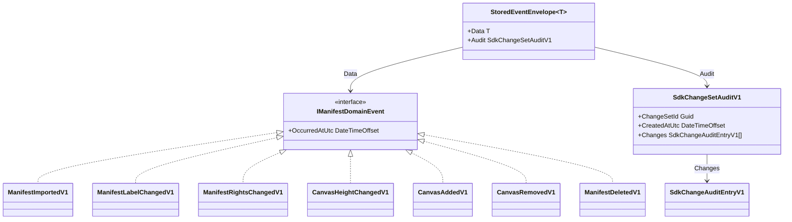

# Domain.Events

## Contents

- [Overview](#overview)
- [Files](#files)
- [Types & members](#types--members)
- [Serialization & contracts](#serialization--contracts)
- [Validation & constraints](#validation--constraints)
- [Diagrams](#diagrams)
- [Examples](#examples)
- [See also](#see-also)

## Overview

This folder holds the replayable domain events that make up a Manifest's KurrentDB stream, the interface they share, the constant event-type names used on the wire, and the two record types that carry SDK change-tracking audit data alongside each event.

Every event is a `sealed record` implementing `IManifestDomainEvent`. Each one stores only the fields needed to rebuild the aggregate on replay — a stable Canvas or Manifest URI rather than a positional index into the SDK object graph. `ManifestEventTypes` maps each record type to the string that KurrentDB stores as the event's type, and `StoredEventEnvelope<T>` is the JSON shape that wraps a domain event together with its optional SDK audit trail before it is written to the stream.

## Files

| File | Primary type(s) | LOC (approx) | Responsibility |
|---|---|---|---|
| `IManifestDomainEvent.cs` | `IManifestDomainEvent` | 7 | Marker interface shared by every replayable event; carries the event timestamp. |
| `ManifestEventTypes.cs` | `ManifestEventTypes` | 27 | Stable event-type-name constants and the `IManifestDomainEvent` → name mapping. |
| `ManifestImportedV1.cs` | `ManifestImportedV1` | 8 | Bootstrap event: the canonical Presentation 3 Manifest at stream revision 0. |
| `ManifestLabelChangedV1.cs` | `ManifestLabelChangedV1` | 13 | Manifest label change. |
| `ManifestRightsChangedV1.cs` | `ManifestRightsChangedV1` | 18 | Manifest rights statement change. |
| `CanvasHeightChangedV1.cs` | `CanvasHeightChangedV1` | 25 | Height change on an existing Canvas, identified by Canvas URI. |
| `CanvasAddedV1.cs` | `CanvasAddedV1` | 33 | A new Canvas appended to the Manifest. |
| `CanvasRemovedV1.cs` | `CanvasRemovedV1` | 39 | A Canvas removed from the Manifest; keeps the removed Canvas's JSON for the record. |
| `ManifestDeletedV1.cs` | `ManifestDeletedV1` | 43 | Tombstone event; marks the aggregate as deleted without erasing history. |
| `SdkChangeAuditEntryV1.cs` | `SdkChangeAuditEntryV1` | 9 | One entry from the SDK's `IiifChangeSet`, stored for audit. |
| `SdkChangeSetAuditV1.cs` | `SdkChangeSetAuditV1` | 14 | The full SDK `IiifChangeSet` snapshot attached to a stored event. |
| `StoredEventEnvelope.cs` | `StoredEventEnvelope<T>` | 6 | JSON envelope pairing a domain event with its optional SDK audit. |

## Types & members

| Type | Kind | Summary | Inherits/Implements | Key members |
|---|---|---|---|---|
| `IManifestDomainEvent` | interface | Shared contract for every replayable event. | — | `OccurredAtUtc` |
| `ManifestEventTypes` | static class | Stable event-type-name constants and the type → name switch. | — | `Imported`, `LabelChanged`, `RightsChanged`, `CanvasHeightChanged`, `CanvasAdded`, `CanvasRemoved`, `Deleted`, `For(IManifestDomainEvent)` |
| `ManifestImportedV1` | sealed record | Bootstrap event carrying the canonical Presentation 3 JSON. | `IManifestDomainEvent` | `ManifestId`, `CanonicalPresentation3Json`, `SourceVersion`, `OccurredAtUtc` |
| `ManifestLabelChangedV1` | sealed record | New Manifest label. | `IManifestDomainEvent` | `Label`, `OccurredAtUtc` |
| `ManifestRightsChangedV1` | sealed record | New Manifest rights statement. | `IManifestDomainEvent` | `Rights`, `OccurredAtUtc` |
| `CanvasHeightChangedV1` | sealed record | Height change on one Canvas. | `IManifestDomainEvent` | `CanvasId`, `PreviousHeight`, `Height`, `OccurredAtUtc` |
| `CanvasAddedV1` | sealed record | A Canvas appended to the Manifest. | `IManifestDomainEvent` | `CanvasId`, `Label`, `Height`, `Width`, `OccurredAtUtc` |
| `CanvasRemovedV1` | sealed record | A Canvas removed from the Manifest. | `IManifestDomainEvent` | `CanvasId`, `RemovedCanvasJson`, `OccurredAtUtc` |
| `ManifestDeletedV1` | sealed record | Tombstone marking the Manifest deleted. | `IManifestDomainEvent` | `OccurredAtUtc` |
| `SdkChangeAuditEntryV1` | sealed record | One SDK change-tracking entry. | — | `Path`, `Kind`, `PropertyName`, `OriginalValueJson`, `CurrentValueJson`, `DetectedAtUtc` |
| `SdkChangeSetAuditV1` | sealed record | A full SDK ChangeSet snapshot. | — | `ChangeSetId`, `CreatedAtUtc`, `Changes` |
| `StoredEventEnvelope<T>` | sealed record | Envelope stored on the KurrentDB event. | generic, constrained to `IManifestDomainEvent` | `Data`, `Audit` |

### IManifestDomainEvent

- Kind: interface
- Namespace: `IIIF.POC.EventSourcedManifestStore.Domain.Events`
- Key properties: `OccurredAtUtc : DateTimeOffset` — when the change occurred, set by the command that raised the event.
- Every event record in this folder implements it, which lets `ManifestEventSerializer` and `ManifestAggregate` handle any event polymorphically as `IManifestDomainEvent` while still pattern-matching on the concrete record for replay.

### ManifestEventTypes

- Kind: static class
- Namespace: `IIIF.POC.EventSourcedManifestStore.Domain.Events`
- Key members:
  - `const string Imported = "iiif.manifest.imported.v1"`
  - `const string LabelChanged = "iiif.manifest.label-changed.v1"`
  - `const string RightsChanged = "iiif.manifest.rights-changed.v1"`
  - `const string CanvasHeightChanged = "iiif.canvas.height-changed.v1"`
  - `const string CanvasAdded = "iiif.canvas.added.v1"`
  - `const string CanvasRemoved = "iiif.canvas.removed.v1"`
  - `const string Deleted = "iiif.manifest.deleted.v1"`
  - `static string For(IManifestDomainEvent @event)` — maps a domain event instance to its stored type name via a type switch; throws `NotSupportedException` for anything not in the switch.
- These names are what KurrentDB stores as the event's `EventType`, not the CLR record name, so renaming a C# type later does not change how already-written events are read back.
- **Usage recipe**: `ManifestEventSerializer.Serialize` calls `ManifestEventTypes.For(@event)` to get the `EventType` string before writing an `EventData` entry to the stream; `ManifestEventSerializer.Deserialize` switches on the same constants to pick which record type to deserialize the stored payload into.

### ManifestImportedV1

- Kind: sealed record
- Namespace: `IIIF.POC.EventSourcedManifestStore.Domain.Events`
- Implements: `IManifestDomainEvent`
- Key properties:
  - `ManifestId : string` — the IIIF Manifest URI.
  - `CanonicalPresentation3Json : string` — the full Manifest, already validated and normalized to Presentation 3.0 by the SDK.
  - `SourceVersion : string` — the Presentation API version the input JSON was written in, before normalization.
  - `OccurredAtUtc : DateTimeOffset`
- This is always revision 0 of a Manifest's stream. `ManifestAggregate.Apply` uses `CanonicalPresentation3Json` to deserialize the live SDK `Manifest` instance that every later event mutates.
- **Usage recipe**:
  ```csharp
  var imported = new ManifestImportedV1(
      manifest.Id,
      canonical,
      sourceVersion,
      DateTimeOffset.UtcNow);

  await eventStore.AppendNewAsync(manifest.Id, imported, audit: null, cancellationToken);
  ```

### ManifestLabelChangedV1

- Kind: sealed record
- Namespace: `IIIF.POC.EventSourcedManifestStore.Domain.Events`
- Implements: `IManifestDomainEvent`
- Key properties: `Label : string`, `OccurredAtUtc : DateTimeOffset`
- **Usage recipe**:
  ```csharp
  manifest.SetLabel([new Label(newLabel)]);
  var domainEvent = new ManifestLabelChangedV1(newLabel, DateTimeOffset.UtcNow);
  ```

### ManifestRightsChangedV1

- Kind: sealed record
- Namespace: `IIIF.POC.EventSourcedManifestStore.Domain.Events`
- Implements: `IManifestDomainEvent`
- Key properties: `Rights : string`, `OccurredAtUtc : DateTimeOffset`
- `Rights` stores the rights statement URI value (for example a Creative Commons license URI), not the SDK's `Rights` object.

### CanvasHeightChangedV1

- Kind: sealed record
- Namespace: `IIIF.POC.EventSourcedManifestStore.Domain.Events`
- Implements: `IManifestDomainEvent`
- Key properties:
  - `CanvasId : string` — the Canvas URI, used to look the Canvas back up on replay.
  - `PreviousHeight : int?` — the height before the change; nullable because a Canvas's height can itself be unset.
  - `Height : int` — the new height.
  - `OccurredAtUtc : DateTimeOffset`
- Replay looks the Canvas up by `CanvasId` rather than by list position, so reordering Canvases later does not break historical replay.

### CanvasAddedV1

- Kind: sealed record
- Namespace: `IIIF.POC.EventSourcedManifestStore.Domain.Events`
- Implements: `IManifestDomainEvent`
- Key properties: `CanvasId : string`, `Label : string`, `Height : int`, `Width : int`, `OccurredAtUtc : DateTimeOffset`
- Carries everything `ManifestAggregate.Apply` needs to reconstruct the added `Canvas` without re-reading the stream that created it.

### CanvasRemovedV1

- Kind: sealed record
- Namespace: `IIIF.POC.EventSourcedManifestStore.Domain.Events`
- Implements: `IManifestDomainEvent`
- Key properties:
  - `CanvasId : string`
  - `RemovedCanvasJson : string` — the removed Canvas serialized to JSON at the moment of removal, kept purely as a record of what was removed.
  - `OccurredAtUtc : DateTimeOffset`
- `RemovedCanvasJson` is not read back during replay; `ManifestAggregate.Apply` only needs `CanvasId` to find and remove the Canvas from the live SDK object.

### ManifestDeletedV1

- Kind: sealed record
- Namespace: `IIIF.POC.EventSourcedManifestStore.Domain.Events`
- Implements: `IManifestDomainEvent`
- Key properties: `OccurredAtUtc : DateTimeOffset`
- Appending this event does not remove the stream or any prior event. `ManifestAggregate` marks itself `IsDeleted` and refuses further mutation, while revisions before the tombstone stay replayable.

### SdkChangeAuditEntryV1

- Kind: sealed record
- Namespace: `IIIF.POC.EventSourcedManifestStore.Domain.Events`
- Key properties:
  - `Path : string` — the SDK's positional path, e.g. `Items[0].Height`.
  - `Kind : string` — the change kind (`Added`, `Modified`, `Removed`, as reported by the SDK), stored as its string form.
  - `PropertyName : string?`
  - `OriginalValueJson : string?`, `CurrentValueJson : string?` — the before/after values, pre-serialized to JSON.
  - `DetectedAtUtc : DateTimeOffset`
- One instance corresponds to one entry in the SDK's `IiifChangeSet.Changes`. `SdkChangeAuditFactory.From` is what builds these from a live `IiifChangeSet`.

### SdkChangeSetAuditV1

- Kind: sealed record
- Namespace: `IIIF.POC.EventSourcedManifestStore.Domain.Events`
- Key properties: `ChangeSetId : Guid`, `CreatedAtUtc : DateTimeOffset`, `Changes : IReadOnlyList<SdkChangeAuditEntryV1>`
- Attached to a stored event as audit information; it is never used to rebuild the aggregate, only to explain what the SDK observed when the command ran.

### StoredEventEnvelope&lt;T&gt;

- Kind: sealed record, generic
- Namespace: `IIIF.POC.EventSourcedManifestStore.Domain.Events`
- Constraint: `where T : IManifestDomainEvent`
- Key properties: `Data : T`, `Audit : SdkChangeSetAuditV1?`
- This is the JSON shape actually written to and read from each KurrentDB event body. `ManifestEventSerializer` serializes `StoredEventEnvelope<T>` for the concrete event type `T`, and deserializes the same shape back on read.
- Serialization notes: serialized with `System.Text.Json`, camelCase property naming, no indentation for storage (a separate indented pass produces the human-readable `RawJson` shown on the Timeline page).

## Serialization & contracts

Every event in this folder is serialized as JSON inside a `StoredEventEnvelope<T>`, with `Data` holding the domain event and `Audit` holding the optional `SdkChangeSetAuditV1`. `ManifestEventTypes.For` decides the KurrentDB `EventType` string independently of the envelope shape, so the stored type name and the payload schema can evolve separately. The `v1` suffix on every constant in `ManifestEventTypes` is deliberate: a `v2` of an event would get its own constant and its own case in the serializer's switch, leaving `v1` payloads already on a stream readable exactly as they were written.

## Validation & constraints

Not applicable. These types carry data produced by validated SDK operations upstream (in `Services`); they do not themselves validate input.

## Diagrams

### Event hierarchy



Every event record implements `IManifestDomainEvent`. When an event is written to KurrentDB, it is wrapped in a `StoredEventEnvelope<T>` alongside an optional `SdkChangeSetAuditV1`, which itself holds one `SdkChangeAuditEntryV1` per SDK-detected change.

[↑ Back to top](#contents)

## Examples

Building a Canvas-height change event from a live SDK mutation:

```csharp
var previous = canvas.Height;
var next = (previous ?? 0) + 100;

canvas.SetHeight(next);

var domainEvent = new CanvasHeightChangedV1(
    canvas.Id,
    previous,
    next,
    DateTimeOffset.UtcNow);
```

## See also

- [Domain](../README.md) — `ManifestAggregate`, which applies every event type in this folder during replay.
- [Infrastructure](../../Infrastructure/README.md) — `ManifestEventSerializer`, which serializes and deserializes these events, and `ManifestEventSerializer`'s `DeserializedManifestEvent` result type.
- [Services](../../Services/README.md) — `ManifestApplicationService` and `SdkChangeAuditFactory`, which construct these events and their audit data from live commands.

[↑ Back to top](#contents)
