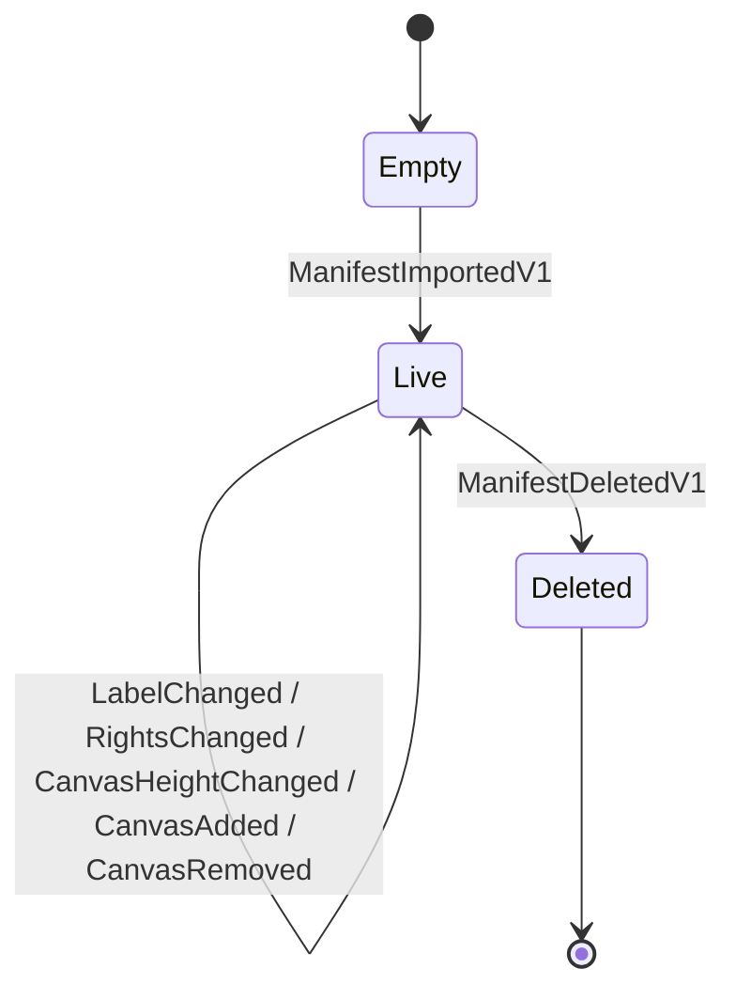

# Domain

## Contents

- [Overview](#overview)
- [Files](#files)
- [Types & members](#types--members)
- [Diagrams](#diagrams)
- [Examples](#examples)
- [See also](#see-also)
- [Children](#children)

## Overview

This folder holds `ManifestAggregate`, the single type that turns a sequence of stored events into a live IIIF Manifest object. It has no knowledge of KurrentDB — it only knows how to apply one `IIIF.POC.EventSourcedManifestStore.Domain.Events` event at a time to an SDK `Manifest` instance, in stream order. `Infrastructure/KurrentManifestEventStore` reads the stream and hands each event to this aggregate; the aggregate does not read or write anything itself.

## Files

| File | Primary type(s) | LOC (approx) | Responsibility |
|---|---|---|---|
| `ManifestAggregate.cs` | `ManifestAggregate` | 121 | Replays domain events onto a live SDK `Manifest` instance and tracks aggregate state (existence, revision, deletion). |

## Types & members

| Type | Kind | Summary | Inherits/Implements | Key members |
|---|---|---|---|---|
| `ManifestAggregate` | sealed class | Rebuilds a Manifest by applying events in order. | — | `Manifest`, `Revision`, `Exists`, `IsDeleted`, `SourceVersion`, `Apply(IManifestDomainEvent, ulong)` |

### ManifestAggregate

- Kind: sealed class
- Namespace: `IIIF.POC.EventSourcedManifestStore.Domain`
- Key properties:
  - `Manifest : Manifest?` — the live SDK object graph, set once the import event is applied.
  - `Revision : ulong` — the stream revision of the last event applied.
  - `Exists : bool` — true once an import event has been applied.
  - `IsDeleted : bool` — true once a `ManifestDeletedV1` has been applied.
  - `SourceVersion : string` — the Presentation API version the Manifest was originally imported from.
- Key methods:
  - `void Apply(IManifestDomainEvent @event, ulong revision)` — pattern-matches on the concrete event type and mutates `Manifest` accordingly, then records `revision`. Throws `NotSupportedException` for any event type it does not recognize.
- Thread-safety: not thread-safe. Each call to `KurrentManifestEventStore.LoadAsync` constructs a fresh `ManifestAggregate`, so instances are never shared across requests.
- Constructors: default parameterless constructor; state is built up entirely through repeated `Apply` calls.
- **Usage recipe**:
  ```csharp
  var aggregate = new ManifestAggregate();

  foreach (var (domainEvent, revision) in eventsInStreamOrder)
      aggregate.Apply(domainEvent, revision);

  if (aggregate.Exists && !aggregate.IsDeleted)
  {
      var manifest = aggregate.Manifest!;
      // manifest is now the live SDK object at `aggregate.Revision`
  }
  ```

`Apply` handles each event type as follows:

- `ManifestImportedV1` — deserializes `CanonicalPresentation3Json` into a new SDK `Manifest`, calls `AcceptChanges()`, and sets `Exists = true`, `IsDeleted = false`, `SourceVersion`.
- `ManifestLabelChangedV1` — calls `Manifest.SetLabel([new Label(...)])`.
- `ManifestRightsChangedV1` — calls `Manifest.SetRights(new Rights(...))`.
- `CanvasHeightChangedV1` — finds the Canvas by `CanvasId` among `Manifest.Items.OfType<Canvas>()` and calls `SetHeight`; throws `InvalidOperationException` if the Canvas is missing.
- `CanvasAddedV1` — constructs a new `Canvas` from the event fields and calls `Manifest.AddItem`.
- `CanvasRemovedV1` — finds the Canvas by `CanvasId` and calls `Manifest.RemoveItem`; throws `InvalidOperationException` if the Canvas is missing, for the same reason as the height-change case: a missing Canvas at this point means the stream is not internally consistent, and replay should fail loudly rather than silently produce a different aggregate than the one that was actually built.
- `ManifestDeletedV1` — sets `IsDeleted = true` without touching `Manifest`.

Every branch except the first calls the private `RequireManifest()` guard first, which throws `InvalidOperationException` if `Exists` is false (no import event yet) or `IsDeleted` is true (a tombstone has already been applied). After each mutation, `Manifest.AcceptChanges()` clears the SDK's change tracker so that the next command's `GetChangeSet()` reflects only that command's mutation, not the replay that reconstructed the aggregate.

## Diagrams

### Replay state



`Exists` becomes true on the first event (always `ManifestImportedV1`, at revision 0). Every later event mutates the live `Manifest` in place until a `ManifestDeletedV1` tombstone is applied, after which `RequireManifest()` rejects any further state-changing event.

[↑ Back to top](#contents)

## Examples

Rejecting a mutation on a deleted Manifest surfaces the same way replay does:

```csharp
aggregate.Apply(new ManifestDeletedV1(DateTimeOffset.UtcNow), revision: 4);

// aggregate.IsDeleted is now true; any further Apply call other than
// re-reading the same tombstone throws InvalidOperationException.
```

## See also

- [Domain.Events](Events/README.md) — every event type `Apply` switches on.
- [Infrastructure](../Infrastructure/README.md) — `KurrentManifestEventStore.LoadAsync`, which drives `Apply` while reading a stream.
- [Services](../Services/README.md) — `ManifestApplicationService`, which loads an aggregate, mutates the live `Manifest` it exposes, and appends the resulting event.

## Children

- [Events](Events/README.md) — the domain event records, the event-type-name mapping, and the SDK ChangeSet audit records.

[↑ Back to top](#contents)
