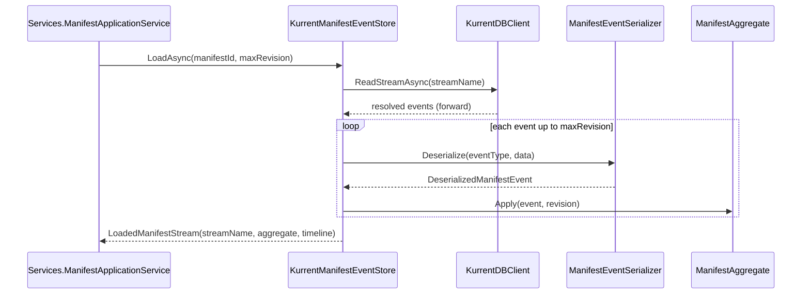
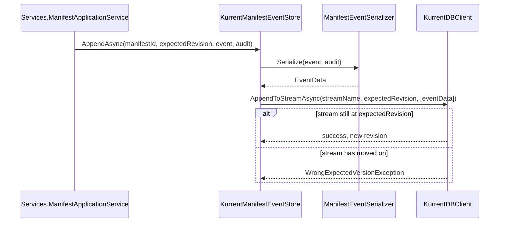

# Infrastructure

## Contents

- [Overview](#overview)
- [Files](#files)
- [Types & members](#types--members)
- [Serialization & contracts](#serialization--contracts)
- [Performance notes](#performance-notes)
- [Package dependencies](#package-dependencies)
- [Diagrams](#diagrams)
- [Examples](#examples)
- [See also](#see-also)

## Overview

This folder is the only place in the application that talks to KurrentDB. `ManifestStreamName` derives a deterministic stream name from a Manifest URI, `ManifestEventSerializer` converts between `IIIF.POC.EventSourcedManifestStore.Domain.Events` records and the bytes stored on an event, and `KurrentManifestEventStore` ties both together into stream reads and appends. `LoadedManifestStream` and `DeserializedManifestEvent` are the plain data carriers those operations return.

## Files

| File | Primary type(s) | LOC (approx) | Responsibility |
|---|---|---|---|
| `KurrentManifestEventStore.cs` | `KurrentManifestEventStore` | 114 | Reads a Manifest's stream into a `ManifestAggregate`, and appends new or expected-revision events. |
| `ManifestEventSerializer.cs` | `ManifestEventSerializer` | 142 | Serializes domain events into `EventData`; deserializes stored bytes back into typed events plus audit. |
| `ManifestStreamName.cs` | `ManifestStreamName` | 20 | Derives the deterministic `iiif-manifest-{sha256(manifestId)}` stream name. |
| `LoadedManifestStream.cs` | `LoadedManifestStream` | 8 | Result of a successful stream load: stream name, replayed aggregate, and timeline. |
| `DeserializedManifestEvent.cs` | `DeserializedManifestEvent` | 8 | Result of deserializing one stored event: type, data, audit, and pretty-printed JSON. |

## Types & members

| Type | Kind | Summary | Inherits/Implements | Key members |
|---|---|---|---|---|
| `KurrentManifestEventStore` | sealed class | Stream-level read/append operations for one Manifest. | — | `LoadAsync`, `AppendNewAsync`, `AppendAsync` |
| `ManifestEventSerializer` | sealed class | Domain event ↔ KurrentDB event-body conversion. | — | `Serialize`, `Deserialize` |
| `ManifestStreamName` | static class | Stream-name derivation. | — | `For(string manifestId)` |
| `LoadedManifestStream` | sealed record | Stream name + aggregate + timeline. | — | `StreamName`, `Aggregate`, `Timeline` |
| `DeserializedManifestEvent` | sealed record | One deserialized stored event. | — | `EventType`, `Data`, `Audit`, `RawJson` |

### KurrentManifestEventStore

- Kind: sealed class
- Namespace: `IIIF.POC.EventSourcedManifestStore.Infrastructure`
- Constructor: `KurrentManifestEventStore(KurrentDBClient client, ManifestEventSerializer serializer)` — both dependencies are injected; registered as scoped in `Program.cs`.
- Key methods:
  - `Task<LoadedManifestStream?> LoadAsync(string manifestId, ulong? maxRevision, CancellationToken)` — reads the stream forward from the start. Returns `null` if the stream does not exist, or if it exists but the aggregate never reached `Exists = true` (which does not happen in practice, since revision 0 is always the import event). When `maxRevision` is set, reading stops before applying any event whose revision exceeds it, which is how historical reconstruction works.
  - `Task AppendNewAsync(string manifestId, IManifestDomainEvent @event, SdkChangeSetAuditV1? audit, CancellationToken)` — appends with `StreamState.NoStream`, so the append fails if the stream already exists. Used only for the initial import event.
  - `Task AppendAsync(string manifestId, ulong expectedRevision, IManifestDomainEvent @event, SdkChangeSetAuditV1? audit, CancellationToken)` — appends with an explicit expected revision, KurrentDB's optimistic-concurrency check. Used for every event after the import.
- Both append methods derive the stream name from `manifestId` via `ManifestStreamName.For` and serialize the event through the injected `ManifestEventSerializer` before calling `KurrentDBClient.AppendToStreamAsync`.
- **Usage recipe**:
  ```csharp
  var loaded = await eventStore.LoadAsync(manifestId, maxRevision: null, cancellationToken);

  if (loaded is { Aggregate.Manifest: not null } && !loaded.Aggregate.IsDeleted)
  {
      // mutate loaded.Aggregate.Manifest, build a domain event, then:
      await eventStore.AppendAsync(
          manifestId,
          loaded.Aggregate.Revision,
          domainEvent,
          audit,
          cancellationToken);
  }
  ```

### ManifestEventSerializer

- Kind: sealed class
- Namespace: `IIIF.POC.EventSourcedManifestStore.Infrastructure`
- Registered as a singleton in `Program.cs` — it holds no per-request state, only the two static `JsonSerializerOptions` instances.
- Key methods:
  - `EventData Serialize(IManifestDomainEvent @event, SdkChangeSetAuditV1? audit)` — resolves the event's stored type name via `ManifestEventTypes.For`, wraps `@event` and `audit` in a `StoredEventEnvelope<T>`, and serializes that envelope to compact, camelCase JSON bytes wrapped in a new `EventData` with a fresh `Uuid`.
  - `DeserializedManifestEvent Deserialize(string eventType, ReadOnlyMemory<byte> payload)` — switches on `eventType` (the `ManifestEventTypes` constants) to pick which `StoredEventEnvelope<T>` to deserialize into, then also re-serializes the envelope with indentation to produce the `RawJson` shown on the Timeline page.
- Both methods throw `NotSupportedException` for an event type they do not recognize — `Serialize` on an unmatched CLR type, `Deserialize` on an unmatched stored type name.
- Serialization notes: uses `System.Text.Json` with `JsonNamingPolicy.CamelCase`; storage JSON is unindented, the `RawJson` copy used for display is indented.

### ManifestStreamName

- Kind: static class
- Namespace: `IIIF.POC.EventSourcedManifestStore.Infrastructure`
- Key methods: `static string For(string manifestId)` — SHA-256-hashes the UTF-8 bytes of `manifestId`, lower-cases the hex digest, and returns `iiif-manifest-{hash}`.
- The hash keeps arbitrary IIIF URI characters out of the physical KurrentDB stream name while remaining fully deterministic: the same Manifest URI always maps to the same stream. The URI itself is not discarded — it lives inside `ManifestImportedV1.ManifestId` and the reconstructed `Manifest.Id`.

### LoadedManifestStream

- Kind: sealed record
- Namespace: `IIIF.POC.EventSourcedManifestStore.Infrastructure`
- Key properties: `StreamName : string`, `Aggregate : ManifestAggregate`, `Timeline : IReadOnlyList<ManifestTimelineEventView>`
- Returned by `KurrentManifestEventStore.LoadAsync`; `Services.ManifestApplicationService` reads `Aggregate` for current state and `Timeline` for the Timeline page.

### DeserializedManifestEvent

- Kind: sealed record
- Namespace: `IIIF.POC.EventSourcedManifestStore.Infrastructure`
- Key properties: `EventType : string`, `Data : IManifestDomainEvent`, `Audit : SdkChangeSetAuditV1?`, `RawJson : string`
- Returned by `ManifestEventSerializer.Deserialize`; `KurrentManifestEventStore.LoadAsync` uses `Data` to drive `ManifestAggregate.Apply` and uses all four fields to build one `ManifestTimelineEventView`.

## Serialization & contracts

The stream body format is owned entirely by `ManifestEventSerializer` and the `StoredEventEnvelope<T>` shape from `Domain.Events`. The KurrentDB `EventType` string (from `ManifestEventTypes`) and the JSON payload shape are independent: a future schema change to an event's fields does not require renaming its `EventType`, and vice versa. Nothing here retries or upcasts an event whose shape has changed since it was written — deserialization of an older or newer JSON shape than the current record definition will fail exactly as `System.Text.Json` fails for any shape mismatch.

## Performance notes

`LoadAsync` reads a stream from `StreamPosition.Start` on every call, applying every event up to `maxRevision` (or to the end of the stream, for current state). There is no snapshot or cached projection — reconstructing a Manifest costs one KurrentDB stream read plus one `ManifestAggregate.Apply` call per event. For the low change frequency this POC assumes (single-digit to low-double-digit events per Manifest lifetime), this is a small, constant amount of work per request. The import event (`ManifestImportedV1`) additionally carries the full canonical Manifest JSON, which is bounded by KurrentDB's per-event size limit; there is no chunking or external-storage fallback for a Manifest whose canonical JSON exceeds that limit.

## Package dependencies

| Package | Version | Description | Links |
|---|---|---|---|
| KurrentDB.Client | 1.4.0 | The base gRPC client library for the Kurrent platform. | [NuGet](https://www.nuget.org/packages/KurrentDB.Client/1.4.0) · [Repository](https://github.com/kurrent-io/KurrentDB-Client-Dotnet) · [kurrent.io](https://kurrent.io/) |

`KurrentDBClient` itself is constructed once in `Program.cs` from the `KurrentDB:ConnectionString` configuration value and registered as a singleton; this folder only consumes it, it does not construct or configure it.

## Diagrams

### Load and replay



Reading stops as soon as an event's revision exceeds `maxRevision`, which is what lets the Details page render either the current aggregate or a historical one from the same code path.

### Append with optimistic concurrency



`AppendNewAsync` follows the same shape but always passes `StreamState.NoStream` instead of an explicit revision, so it only succeeds the first time a given Manifest is imported.

[↑ Back to top](#contents)

## Examples

Deriving a stream name directly, outside the store:

```csharp
var streamName = ManifestStreamName.For("https://example.org/iiif/book-1/manifest");
// "iiif-manifest-<sha256 hex>"
```

## See also

- [Domain](../Domain/README.md) — `ManifestAggregate`, applied inside `LoadAsync`.
- [Domain.Events](../Domain/Events/README.md) — the event and audit records serialized here.
- [Services](../Services/README.md) — `ManifestApplicationService`, the only consumer of `KurrentManifestEventStore`.

[↑ Back to top](#contents)
