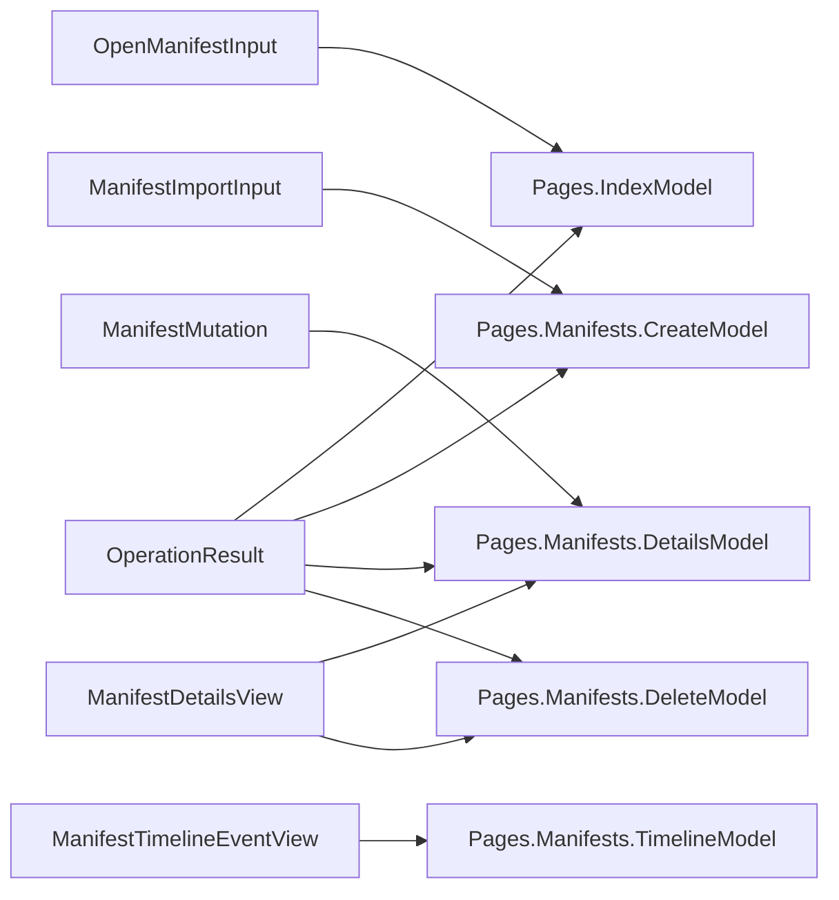

# Models

## Contents

- [Overview](#overview)
- [Files](#files)
- [Types & members](#types--members)
- [Validation & constraints](#validation--constraints)
- [Diagrams](#diagrams)
- [See also](#see-also)

## Overview

This folder holds the plain data types that cross the boundary between the Razor Pages and `Services.ManifestApplicationService`: two form-input models with validation attributes, two read view models handed back to the pages, one result type for command outcomes, and the `ManifestMutation` enum that identifies which command a Details-page form is submitting. None of these types contain behavior — they exist to give the page models and the service a typed, non-`Domain.Events` vocabulary to pass state across the boundary.

## Files

| File | Primary type(s) | LOC (approx) | Responsibility |
|---|---|---|---|
| `ManifestImportInput.cs` | `ManifestImportInput` | 10 | Bound input for the Create page's Manifest JSON textarea. |
| `OpenManifestInput.cs` | `OpenManifestInput` | 10 | Bound input for the Index page's "open by id" form. |
| `ManifestMutation.cs` | `ManifestMutation` | 10 | Identifies which Details-page command a posted form represents. |
| `ManifestDetailsView.cs` | `ManifestDetailsView` | 14 | Read view model rendered by the Details page. |
| `ManifestTimelineEventView.cs` | `ManifestTimelineEventView` | 11 | Read view model rendered by the Timeline page, one per stored event. |
| `OperationResult.cs` | `OperationResult` | 14 | Outcome of an import, mutate, or delete command. |

## Types & members

| Type | Kind | Summary | Inherits/Implements | Key members |
|---|---|---|---|---|
| `ManifestImportInput` | sealed class | Bound Manifest JSON input. | — | `Json` |
| `OpenManifestInput` | sealed class | Bound Manifest id input. | — | `ManifestId` |
| `ManifestMutation` | enum | Which Details-page command was submitted. | — | `RenameManifest`, `ToggleRights`, `IncreaseFirstCanvasHeight`, `AddCanvas`, `RemoveLastCanvas` |
| `ManifestDetailsView` | sealed record | Everything the Details page renders. | — | `ManifestId`, `Label`, `SourceVersion`, `Revision`, `IsDeleted`, `StreamName`, `Presentation3Json`, `CanvasCount`, `EventCount`, `IsHistorical` |
| `ManifestTimelineEventView` | sealed record | One row on the Timeline page. | — | `Revision`, `EventId`, `EventType`, `OccurredAtUtc`, `RawJson`, `Audit` |
| `OperationResult` | sealed class | Command outcome. | — | `Succeeded`, `ConcurrencyConflict`, `Error`, `ManifestId`, `Revision` |

### ManifestImportInput

- Kind: sealed class
- Namespace: `IIIF.POC.EventSourcedManifestStore.Models`
- Key properties: `Json : string` — `[Required]`, displayed as "Manifest JSON".
- Bound via `[BindProperty]` on `Pages.Manifests.CreateModel.Input`. `Json` holds the raw Presentation 2.x or 3.0 text pasted into the Create page's textarea before it reaches `ManifestApplicationService.ImportAsync`.
- Validation notes: `[Required]` only checks the field is non-empty; the actual IIIF and JSON structure validation happens inside `ManifestApplicationService.ImportAsync`, not here.

### OpenManifestInput

- Kind: sealed class
- Namespace: `IIIF.POC.EventSourcedManifestStore.Models`
- Key properties: `ManifestId : string` — `[Required]`, displayed as "IIIF Manifest id".
- Bound via `[BindProperty]` on `Pages.IndexModel.Input`. Holds the IIIF Manifest URI entered on the Index page before the app derives its stream name and attempts a replay.

### ManifestMutation

- Kind: enum
- Namespace: `IIIF.POC.EventSourcedManifestStore.Models`
- Members: `RenameManifest`, `ToggleRights`, `IncreaseFirstCanvasHeight`, `AddCanvas`, `RemoveLastCanvas`
- Posted as a hidden form field on each command form on the Details page and read by `Pages.Manifests.DetailsModel.OnPostMutateAsync`, which passes it straight through to `ManifestApplicationService.MutateAsync`. The switch inside `MutateAsync` is the only place that interprets these values.

### ManifestDetailsView

- Kind: sealed record
- Namespace: `IIIF.POC.EventSourcedManifestStore.Models`
- Key properties:
  - `ManifestId : string`, `Label : string`, `SourceVersion : string`
  - `Revision : ulong` — the aggregate's stream revision this view reflects.
  - `IsDeleted : bool`
  - `StreamName : string` — the deterministic KurrentDB stream name.
  - `Presentation3Json : string` — the reconstructed Manifest, pretty-printed.
  - `CanvasCount : int`, `EventCount : int`
  - `IsHistorical : bool` — true when this view was built for a specific past revision rather than the current stream head.
- Built entirely inside `ManifestApplicationService.GetAsync`, one field at a time, from a loaded `Infrastructure.LoadedManifestStream`. Nothing on this record is nullable; `GetAsync` returns `null` for the whole view instead of a partially populated one when the Manifest cannot be loaded.

### ManifestTimelineEventView

- Kind: sealed record
- Namespace: `IIIF.POC.EventSourcedManifestStore.Models`
- Key properties: `Revision : ulong`, `EventId : string`, `EventType : string`, `OccurredAtUtc : DateTimeOffset`, `RawJson : string`, `Audit : SdkChangeSetAuditV1?`
- One instance per stored event, built by `Infrastructure.KurrentManifestEventStore.LoadAsync` as it walks the stream. `Audit` is `null` for events appended without an SDK ChangeSet — currently `ManifestImportedV1` and `ManifestDeletedV1`.

### OperationResult

- Kind: sealed class
- Namespace: `IIIF.POC.EventSourcedManifestStore.Models`
- Key properties:
  - `Succeeded : bool`
  - `ConcurrencyConflict : bool` — true when the failure was specifically a KurrentDB expected-revision mismatch.
  - `Error : string?`
  - `ManifestId : string?`
  - `Revision : ulong?` — the new revision after a successful append.
- Returned by every command method on `ManifestApplicationService` (`ImportAsync`, `MutateAsync`, `DeleteAsync`). The page models branch on `Succeeded` and `ConcurrencyConflict` to decide what status message to show; `ConcurrencyConflict` specifically lets a page tell the user to reload rather than just reporting a generic failure.

## Validation & constraints

`ManifestImportInput.Json` and `OpenManifestInput.ManifestId` both carry `[Required]`, enforced by Razor Pages model binding before the corresponding `OnPostAsync` handler runs. There is no length, format, or URI-shape validation on either field at this layer — a syntactically invalid Manifest id or malformed JSON is rejected later, inside `ManifestApplicationService`, not here.

## Diagrams

### Where each model is consumed

Each model type is produced or consumed on one side of the `Services.ManifestApplicationService` boundary: the two input types flow in from a page's bound `[BindProperty]`, and the three result/view types flow back out.

[↑ Back to top](#contents)

## See also

- [Services](../Services/README.md) — `ManifestApplicationService`, which builds `ManifestDetailsView`, `ManifestTimelineEventView`, and `OperationResult`, and interprets `ManifestMutation`.
- [Pages](../Pages/README.md) — `IndexModel`, which binds `OpenManifestInput`.
- [Pages.Manifests](../Pages/Manifests/README.md) — `CreateModel`, `DetailsModel`, `DeleteModel`, `TimelineModel`, the consumers of every type in this folder.

[↑ Back to top](#contents)
