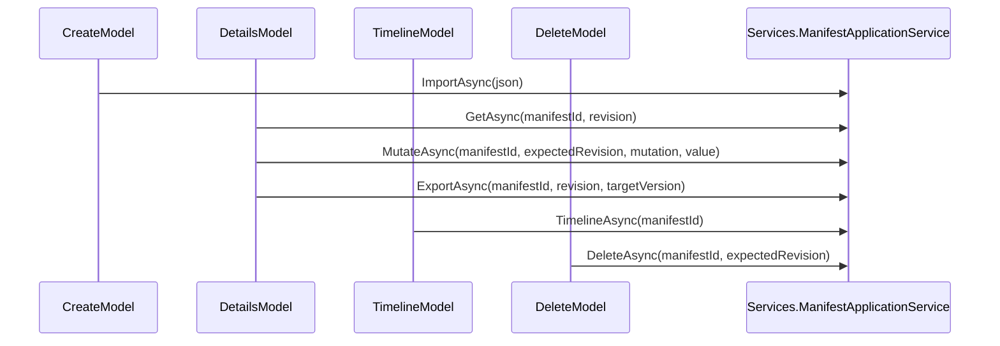

# Pages.Manifests

## Contents

- [Overview](#overview)
- [Files](#files)
- [Types & members](#types--members)
- [Diagrams](#diagrams)
- [Examples](#examples)
- [See also](#see-also)

## Overview

These four Razor Pages are where a Manifest's stream is created, inspected, mutated, and tombstoned. `Create` writes the import event that starts a stream. `Details` renders the current or a historical aggregate and hosts the mutation and export forms. `Timeline` lists every stored event with its SDK ChangeSet audit. `Delete` confirms and appends the tombstone event. Every page model here calls straight into `Services.ManifestApplicationService` — none of them talk to `Infrastructure` or `Domain` directly.

## Files

| File | Primary type(s) | LOC (approx) | Responsibility |
|---|---|---|---|
| `Create.cshtml` / `Create.cshtml.cs` | `CreateModel` | 51 (code-behind) | Form to paste Manifest JSON and create stream revision 0. |
| `Details.cshtml` / `Details.cshtml.cs` | `DetailsModel` | 113 (code-behind) | Current/historical Manifest view, mutation commands, and version-aware export links. |
| `Timeline.cshtml` / `Timeline.cshtml.cs` | `TimelineModel` | 33 (code-behind) | Full event list with per-event SDK ChangeSet audit and stored JSON. |
| `Delete.cshtml` / `Delete.cshtml.cs` | `DeleteModel` | 55 (code-behind) | Tombstone confirmation and append. |

## Types & members

| Type | Kind | Summary | Inherits/Implements | Key members |
|---|---|---|---|---|
| `CreateModel` | sealed class | Handles the import form. | `PageModel` | `Input`, `OnGet`, `OnPostAsync` |
| `DetailsModel` | sealed class | Renders and mutates a Manifest. | `PageModel` | `Manifest`, `NewLabel`, `RequestedRevision`, `OnGetAsync`, `OnPostMutateAsync`, `OnGetExportAsync` |
| `TimelineModel` | sealed class | Renders the full event list. | `PageModel` | `ManifestId`, `Events`, `OnGetAsync` |
| `DeleteModel` | sealed class | Confirms and appends the tombstone. | `PageModel` | `Manifest`, `OnGetAsync`, `OnPostAsync` |

### CreateModel

- Kind: sealed class
- Namespace: `IIIF.POC.EventSourcedManifestStore.Pages.Manifests`
- Constructor: `CreateModel(ManifestApplicationService manifests)`
- Key members:
  - `[BindProperty] Input : ManifestImportInput`
  - `void OnGet()` — pre-fills `Input.Json` with a small two-Canvas Presentation 3.0 sample Manifest, so the page is usable without hand-writing JSON first.
  - `Task<IActionResult> OnPostAsync(CancellationToken)` — calls `ManifestApplicationService.ImportAsync(Input.Json, ...)`. On success, sets a status message and redirects to `Details` for the new Manifest id; on failure, adds a model error and re-renders the form.
- **Usage recipe**: `GET /Manifests/Create` to see the sample JSON, edit it, `POST` to create the stream, and the app redirects straight to `Details` if the import succeeds.

### DetailsModel

- Kind: sealed class
- Namespace: `IIIF.POC.EventSourcedManifestStore.Pages.Manifests`
- Constructor: `DetailsModel(ManifestApplicationService manifests)`
- Key members:
  - `Manifest : ManifestDetailsView` — set by `OnGetAsync`.
  - `[BindProperty] NewLabel : string?` — bound from the rename form's text input.
  - `RequestedRevision : ulong?` — the `revision` query value the page was requested with, echoed back so the export links can preserve it.
  - `Task<IActionResult> OnGetAsync(string manifestId, ulong? revision, CancellationToken)` — loads the view via `ManifestApplicationService.GetAsync`; returns `NotFound()` if it comes back null.
  - `Task<IActionResult> OnPostMutateAsync(string manifestId, ulong expectedRevision, ManifestMutation mutation, CancellationToken)` — calls `ManifestApplicationService.MutateAsync`, sets a status message from the result, and redirects back to the same `manifestId`.
  - `Task<IActionResult> OnGetExportAsync(string manifestId, ulong? revision, string target, CancellationToken)` — maps `target` (`"v2.0"`, `"v2.1"`, anything else defaults to `"v3.0"`) to an `IiifPresentationVersion`, calls `ManifestApplicationService.ExportAsync`, and returns the result as a downloadable JSON file named `iiif-manifest{-r<revision>|-current}-{target}.json`.
- Each mutation form on the page posts `manifestId`, `expectedRevision`, and `mutation` as hidden fields to the `Mutate` handler; `manifestId` travels as a hidden field rather than relying on the page's ambient route values, since `OnPostMutateAsync`'s `manifestId` parameter is not part of this page's route template.
- **Usage recipe**: `GET /Manifests/Details?manifestId=...` for current state, or `&revision=N` for a historical view (which hides the mutation forms and the Delete link, since historical views are read-only).

### TimelineModel

- Kind: sealed class
- Namespace: `IIIF.POC.EventSourcedManifestStore.Pages.Manifests`
- Constructor: `TimelineModel(ManifestApplicationService manifests)`
- Key members:
  - `ManifestId : string`, `Events : IReadOnlyList<ManifestTimelineEventView>`
  - `Task<IActionResult> OnGetAsync(string manifestId, CancellationToken)` — calls `ManifestApplicationService.TimelineAsync`; returns `NotFound()` if the stream does not exist.
- The page itself sorts `Events` by revision descending before rendering, so the most recent event is always at the top.

### DeleteModel

- Kind: sealed class
- Namespace: `IIIF.POC.EventSourcedManifestStore.Pages.Manifests`
- Constructor: `DeleteModel(ManifestApplicationService manifests)`
- Key members:
  - `Manifest : ManifestDetailsView`
  - `Task<IActionResult> OnGetAsync(string manifestId, CancellationToken)` — loads the current view; `NotFound()` if missing.
  - `Task<IActionResult> OnPostAsync(string manifestId, ulong expectedRevision, CancellationToken)` — calls `ManifestApplicationService.DeleteAsync`, sets a status message, and redirects to `Details`.
- The confirmation form has no `asp-page-handler` and no explicit `asp-route-*` values, so its plain `action`-less `<form method="post">` submits back to the same URL the page was loaded from, `manifestId` included, since that value arrived as part of the query string on the `GET`.

## Diagrams

### Page-to-service calls



Every handler in this folder is a thin adapter: bind and validate the request, call one `ManifestApplicationService` method, and turn the result into a redirect, a rendered page, `NotFound()`, or a file download.

[↑ Back to top](#contents)

## Examples

A mutation form on the Details page, as rendered:

```html
<form method="post" asp-page-handler="Mutate">
    <input type="hidden" name="manifestId" value="https://example.org/iiif/book-1/manifest" />
    <input type="hidden" name="expectedRevision" value="4" />
    <input type="hidden" name="mutation" value="ToggleRights" />
    <button type="submit">Change rights</button>
</form>
```

## See also

- [Pages](../README.md) — `IndexModel`, the entry point that redirects into `Details`.
- [Services](../../Services/README.md) — `ManifestApplicationService`, called by every handler in this folder.
- [Models](../../Models/README.md) — `ManifestDetailsView`, `ManifestTimelineEventView`, `ManifestMutation`, `OperationResult`.

[↑ Back to top](#contents)
