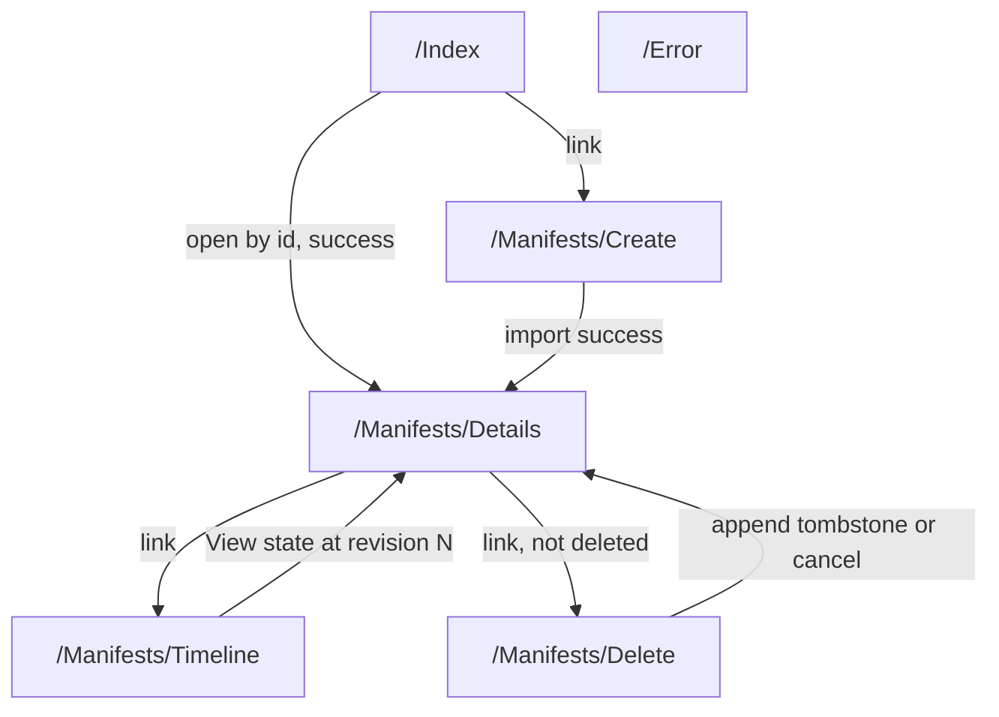

# Pages

## Contents

- [Overview](#overview)
- [Files](#files)
- [Types & members](#types--members)
- [Diagrams](#diagrams)
- [See also](#see-also)
- [Children](#children)

## Overview

This folder is the ASP.NET Core Razor Pages root: the landing page (`Index`), the shared error page, and the two Razor configuration files that apply to every page in the app. The Manifest-specific pages — create, view, mutate, export, delete, and timeline — live one level down, in [Pages.Manifests](Manifests/README.md).

## Files

| File | Primary type(s) | LOC (approx) | Responsibility |
|---|---|---|---|
| `Index.cshtml` / `Index.cshtml.cs` | `IndexModel` | 47 (code-behind) | Landing page: open an existing Manifest by id, or link to Create. |
| `Error.cshtml` / `Error.cshtml.cs` | `ErrorModel` | 25 (code-behind) | Shared error page shown by `UseExceptionHandler("/Error")`. |
| `_ViewImports.cshtml` | — | 5 | Shared `@using`/`@namespace`/tag-helper directives for every page. |
| `_ViewStart.cshtml` | — | 4 | Selects `Pages/Shared/_Layout` for every page. |

## Types & members

| Type | Kind | Summary | Inherits/Implements | Key members |
|---|---|---|---|---|
| `IndexModel` | sealed class | Landing page: open a Manifest by id. | `PageModel` | `Input`, `OnGet`, `OnPostAsync` |
| `ErrorModel` | sealed class | Shared error page. | `PageModel`, `[ResponseCache(NoStore = true)]` | `RequestId`, `ShowRequestId`, `OnGet` |

### IndexModel

- Kind: sealed class
- Namespace: `IIIF.POC.EventSourcedManifestStore.Pages`
- Constructor: `IndexModel(ManifestApplicationService manifests)`
- Key members:
  - `[BindProperty] Input : OpenManifestInput`
  - `void OnGet()` — no-op; the page just renders the empty form.
  - `Task<IActionResult> OnPostAsync(CancellationToken)` — calls `ManifestApplicationService.GetAsync(Input.ManifestId.Trim(), revision: null, ...)`. If a view comes back, redirects to `/Manifests/Details` for that id; otherwise adds a model error stating no event stream exists for that id.
- This is the only page that reads a Manifest id from free-text input rather than from a route/query value already known to be valid — every other page reaches a Manifest id through a link generated from a `ManifestDetailsView` or `ManifestTimelineEventView` that already came from a successful load.

### ErrorModel

- Kind: sealed class
- Namespace: `IIIF.POC.EventSourcedManifestStore.Pages`
- Attributes: `[ResponseCache(Duration = 0, Location = ResponseCacheLocation.None, NoStore = true)]` — prevents the error page itself from being cached.
- Key members:
  - `RequestId : string?`, `ShowRequestId : bool` (true when `RequestId` is non-empty)
  - `void OnGet()` — sets `RequestId` from `Activity.Current?.Id`, falling back to `HttpContext.TraceIdentifier`.
- Reached only through `app.UseExceptionHandler("/Error")` in `Program.cs`, and only outside the Development environment.

## Diagrams

### Route map

`/Error` is not reachable from any in-app link; it is only ever reached through the exception-handling middleware in `Program.cs`.

[↑ Back to top](#contents)

## See also

- [Services](../Services/README.md) — `ManifestApplicationService`, the only dependency of `IndexModel`.
- [Models](../Models/README.md) — `OpenManifestInput`.

## Children

- [Manifests](Manifests/README.md) — create, view, mutate, export, delete, and timeline pages for one Manifest.
- [Shared](Shared/README.md) — the layout every page renders into.

[↑ Back to top](#contents)
