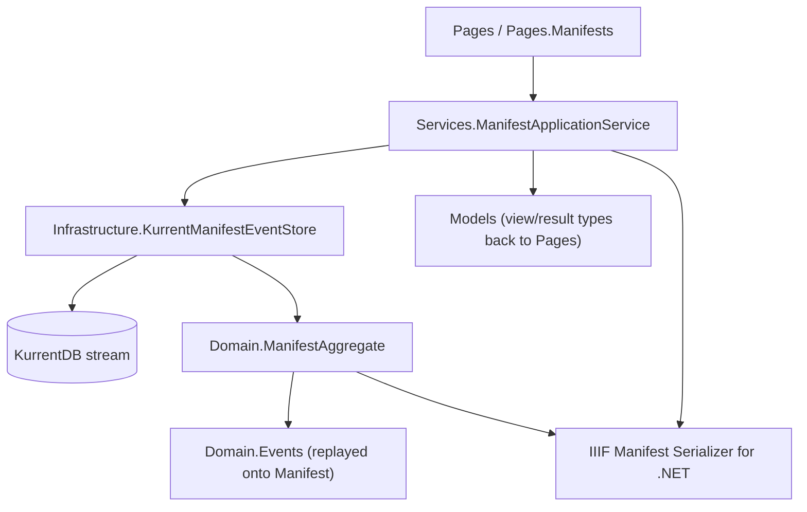

# Documentation

## Contents

- [Overview](#overview)
- [Composition root](#composition-root)
- [Areas](#areas)
- [Diagrams](#diagrams)

## Overview

This is the generated documentation for **IIIF.POC.EventSourcedManifestStore**, a .NET 10 Razor Pages proof of concept that stores IIIF Manifest state as KurrentDB event streams instead of a current-state database. One Manifest maps to one deterministic stream; the current or a historical Manifest is produced by replaying that stream into the real IIIF Manifest Serializer for .NET object model, not by querying a separate table.

Each area below documents one folder under the project root. `Domain` and `Domain.Events` cover how a stream is replayed into a live Manifest; `Infrastructure` covers how that stream is actually read from and written to KurrentDB; `Services` covers the command and query operations the Razor Pages call; `Models` covers the data types that cross the Pages ↔ Services boundary; `Pages` covers the Razor Pages themselves.

## Composition root

Three files sit directly in the project root, outside every area documented below:

| File | Responsibility |
|---|---|
| `Program.cs` | Reads `KurrentDB:ConnectionString` from configuration, constructs the singleton `KurrentDBClient`, registers `ManifestEventSerializer` (singleton), `KurrentManifestEventStore` and `ManifestApplicationService` (both scoped), and wires up Razor Pages with the standard HTTPS-redirection/HSTS/exception-handler middleware. |
| `appsettings.json` | Holds `KurrentDB:ConnectionString` (`kurrentdb://localhost:2113?tls=false` by default) and standard ASP.NET Core logging configuration. |
| `compose.yaml` | Defines a single `kurrentdb` service (container name `iiif-kurrentdb`, image `docker.kurrent.io/kurrent-latest/kurrentdb:latest`) for local development: one insecure, single-node cluster with standard projections and AtomPub-over-HTTP enabled, port `2113` published, and named volumes for its data and log directories. |

`Program.cs` fails fast with an `InvalidOperationException` if `KurrentDB:ConnectionString` is missing, rather than falling back to a default at startup.

## Areas

- [Domain](Domain/README.md) — `ManifestAggregate`, the type that replays events onto a live SDK `Manifest`.
  - [Events](Domain/Events/README.md) — the domain event records, the stable event-type-name mapping, and the SDK ChangeSet audit records.
- [Infrastructure](Infrastructure/README.md) — `KurrentManifestEventStore`, `ManifestEventSerializer`, and `ManifestStreamName`; the only folder that talks to `KurrentDBClient`.
- [Models](Models/README.md) — bound input types, read view models, and the command-result type shared between Pages and Services.
- [Pages](Pages/README.md) — the Razor Pages root: `Index`, `Error`, and the shared layout/view configuration.
  - [Manifests](Pages/Manifests/README.md) — `Create`, `Details`, `Timeline`, and `Delete`, the pages for one Manifest.
  - [Shared](Pages/Shared/README.md) — the layout every page renders into.
- [Services](Services/README.md) — `ManifestApplicationService`, the single entry point every page calls.

## Diagrams

### Request-to-stream flow

A read request flows down to `KurrentManifestEventStore`, which reads the stream and drives `ManifestAggregate.Apply` for every event up to the requested revision; a write request follows the same path, then mutates the live `Manifest` the aggregate already holds and appends one new event with the stream revision it was loaded at as the expected revision.

[↑ Back to top](#contents)
