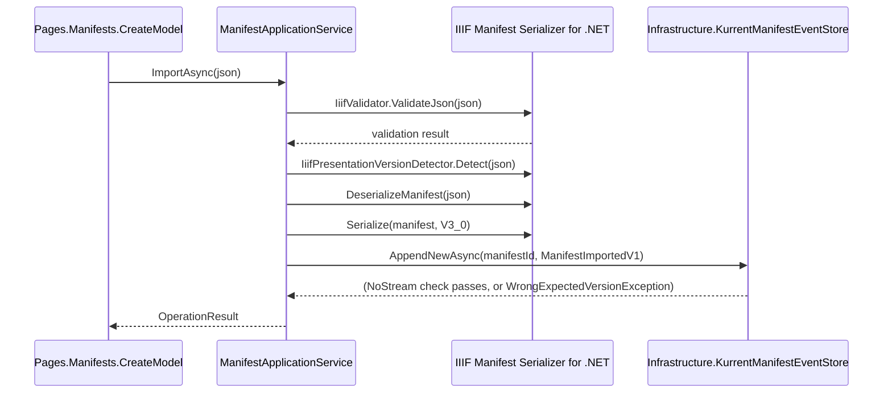
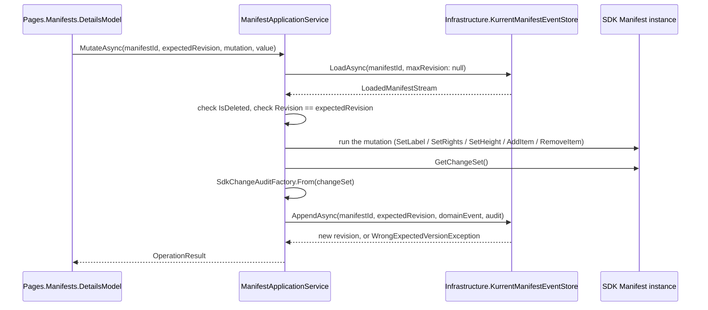

# Services

## Contents

- [Overview](#overview)
- [Files](#files)
- [Types & members](#types--members)
- [Validation & constraints](#validation--constraints)
- [Package dependencies](#package-dependencies)
- [Diagrams](#diagrams)
- [Examples](#examples)
- [See also](#see-also)

## Overview

`ManifestApplicationService` is the single entry point every Razor Page calls into. It owns the whole command sequence — validate, load, mutate the live SDK `Manifest`, capture a ChangeSet, build a domain event, append it — and every read path — load, replay, serialize for display or export. `IiifLabelFormatter` and `SdkChangeAuditFactory` are small internal helpers it uses along the way: the first picks a displayable label out of a Manifest's multi-language `Label` collection, the second turns a live SDK `IiifChangeSet` into the `SdkChangeSetAuditV1` record that gets stored with an event.

## Files

| File | Primary type(s) | LOC (approx) | Responsibility |
|---|---|---|---|
| `ManifestApplicationService.cs` | `ManifestApplicationService` | 477 | Import, read, mutate, export, and delete operations against a Manifest's event stream. |
| `IiifLabelFormatter.cs` | `IiifLabelFormatter` | 15 | Picks the first non-empty label value out of an SDK `Label` collection. |
| `SdkChangeAuditFactory.cs` | `SdkChangeAuditFactory` | 47 | Converts a live SDK `IiifChangeSet` into a `SdkChangeSetAuditV1`. |

## Types & members

| Type | Kind | Summary | Inherits/Implements | Key members |
|---|---|---|---|---|
| `ManifestApplicationService` | sealed class | Command and query operations for one Manifest. | — | `ImportAsync`, `GetAsync`, `TimelineAsync`, `ExportAsync`, `MutateAsync`, `DeleteAsync` |
| `IiifLabelFormatter` | internal static class | Label-collection → display string. | — | `FirstOrDefault(IEnumerable<Label>)` |
| `SdkChangeAuditFactory` | internal static class | `IiifChangeSet` → `SdkChangeSetAuditV1`. | — | `From(IiifChangeSet)`, `SerializeValue(object?)` |

### ManifestApplicationService

- Kind: sealed class
- Namespace: `IIIF.POC.EventSourcedManifestStore.Services`
- Constructor: `ManifestApplicationService(KurrentManifestEventStore eventStore)` — registered as scoped in `Program.cs`.
- Key methods:
  - `Task<OperationResult> ImportAsync(string json, CancellationToken)` — validates the input with `IiifValidator.ValidateJson`, detects its source Presentation version with `IiifPresentationVersionDetector.Detect`, deserializes it into an SDK `Manifest`, re-serializes that Manifest as canonical Presentation 3.0, builds a `ManifestImportedV1`, and appends it with `KurrentManifestEventStore.AppendNewAsync`. Catches `System.Text.Json.JsonException`, Newtonsoft's `JsonException`, `ArgumentException`, and `NotSupportedException` from the SDK path and turns them into a failed `OperationResult`; catches a concurrency exception from the append and reports that a stream for the Manifest already exists.
  - `Task<ManifestDetailsView?> GetAsync(string manifestId, ulong? revision, CancellationToken)` — loads the stream (optionally capped at `revision`), and if the aggregate has a `Manifest`, builds a `ManifestDetailsView` from it: label via `IiifLabelFormatter`, current Presentation 3.0 JSON via `IiifSerializer.Serialize`, Canvas count, event count, and whether this is a historical view (`revision.HasValue`).
  - `Task<IReadOnlyList<ManifestTimelineEventView>?> TimelineAsync(string manifestId, CancellationToken)` — loads the full stream and returns its timeline, or `null` if the stream does not exist.
  - `Task<string?> ExportAsync(string manifestId, ulong? revision, IiifPresentationVersion targetVersion, CancellationToken)` — loads the stream (optionally at `revision`) and serializes the resulting Manifest at `targetVersion`. Returns `null` for a missing Manifest, and also for a *current* (non-historical) view of a deleted Manifest — a historical, pre-deletion revision can still be exported.
  - `Task<OperationResult> MutateAsync(string manifestId, ulong expectedRevision, ManifestMutation mutation, string? value, CancellationToken)` — loads the current aggregate, rejects if deleted or if the aggregate's revision no longer matches `expectedRevision`, then runs the mutation named by `mutation` directly against the live SDK `Manifest`, reads `manifest.GetChangeSet()`, converts it with `SdkChangeAuditFactory.From`, builds the matching domain event, and appends it with the same `expectedRevision`. Returns a failure if the SDK reports `HasChanges == false` after the mutation — a signal that the command did not actually change anything.
  - `Task<OperationResult> DeleteAsync(string manifestId, ulong expectedRevision, CancellationToken)` — the same load-and-check-revision sequence as `MutateAsync`, but always appends a `ManifestDeletedV1` with no audit.
- Private helpers: `IsConcurrencyException(Exception)` (pattern-matches `KurrentDB.Client.WrongExpectedVersionException`), `PrettyPrint(string json)` (re-serializes JSON with indentation for display), and the `Success`/`Failure`/`Conflict` factory methods that build an `OperationResult`.
- Every mutation branch inside `MutateAsync` mirrors the shape described in [Domain](../Domain/README.md#manifestaggregate): mutate the live `Manifest` through its SDK API, then build the domain event that describes the same change in stable, replayable terms.

### IiifLabelFormatter

- Kind: internal static class
- Namespace: `IIIF.POC.EventSourcedManifestStore.Services`
- Key methods: `static string FirstOrDefault(IEnumerable<Label> labels)` — returns the first label value that is not null or whitespace, or the literal string `"(untitled)"` if none qualifies.
- Used by `ManifestApplicationService.GetAsync` to reduce a Manifest's (possibly multi-language) `Label` collection to the single string `ManifestDetailsView.Label` shown on the Details page.

### SdkChangeAuditFactory

- Kind: internal static class
- Namespace: `IIIF.POC.EventSourcedManifestStore.Services`
- Key methods:
  - `static SdkChangeSetAuditV1 From(IiifChangeSet changeSet)` — maps every entry in `changeSet.Changes` to a `SdkChangeAuditEntryV1` (path, change kind as a string, property name, and both values pre-serialized to JSON), and wraps the list with a fresh `Guid` and `changeSet.CreatedAtUtc`.
  - `static string SerializeValue(object? value)` — returns the literal `"null"` for a null value, otherwise serializes with Newtonsoft's `JsonConvert.SerializeObject` using an `IIIFJsonContractResolver`, ignoring reference loops and null values.
- This is the only place the SDK's `IiifChangeSet` — a live, in-memory audit of one command's mutation — becomes the `SdkChangeSetAuditV1` record that gets stored alongside a domain event.

## Validation & constraints

`ImportAsync` is the one place in the whole application that validates a Manifest's shape and content, via `IiifValidator.ValidateJson`; a failed validation returns the first reported error's rule id, path, and message rather than the raw SDK exception. `MutateAsync` enforces two invariants of its own before touching the SDK Manifest: the aggregate must not be deleted, and `expectedRevision` must match the aggregate's actual revision — the second is what makes the eventual KurrentDB append an optimistic-concurrency check rather than a blind overwrite.

## Package dependencies

| Package | Version | Description | Links |
|---|---|---|---|
| IIIF.Manifest.Serializer.Net | 3.0.17 | Version-aware IIIF Presentation API manifest serializer using Newtonsoft.Json. | [NuGet](https://www.nuget.org/packages/IIIF.Manifest.Serializer.Net/3.0.17) · [Repository](https://github.com/KiarashMinoo/IIIF.Manifest.Serializer.Net) · MIT |
| Newtonsoft.Json | 13.0.4 | Json.NET, a high-performance JSON framework for .NET. | [NuGet](https://www.nuget.org/packages/Newtonsoft.Json/13.0.4) · [newtonsoft.com/json](https://www.newtonsoft.com/json) · MIT |

`ManifestApplicationService` and `SdkChangeAuditFactory` both use `IIIF.Manifest.Serializer.Net` for Manifest validation, deserialization, mutation, and version-aware serialization, and Newtonsoft.Json (through `IIIFJsonContractResolver`) to serialize the removed-Canvas snapshot in `CanvasRemovedV1.RemovedCanvasJson` and the before/after values inside `SdkChangeAuditEntryV1`.

## Diagrams

### Import



A failed validation, an unparsable JSON body, or an append against an already-existing stream all produce a failed `OperationResult` rather than an unhandled exception reaching the page.

### Mutate



The revision check happens before the SDK Manifest is touched, so a stale page reload fails the command before any mutation is attempted, not after.

[↑ Back to top](#contents)

## Examples

Exporting a historical revision as Presentation 2.0:

```csharp
var json = await manifests.ExportAsync(
    manifestId,
    revision: 3,
    IiifPresentationVersion.V2_0,
    cancellationToken);
```

## See also

- [Domain](../Domain/README.md) — `ManifestAggregate`, loaded and mutated by every method here.
- [Domain.Events](../Domain/Events/README.md) — the events built by `ImportAsync`, `MutateAsync`, and `DeleteAsync`.
- [Infrastructure](../Infrastructure/README.md) — `KurrentManifestEventStore`, the only dependency of `ManifestApplicationService`.
- [Models](../Models/README.md) — the input, view, and result types passed to and returned from every method here.
- [Pages.Manifests](../Pages/Manifests/README.md) — the page handlers that call every method on `ManifestApplicationService`.

[↑ Back to top](#contents)
